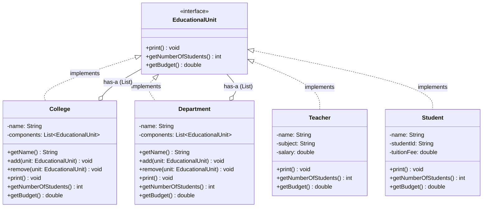

# 🎓 New Era University — Composite Design Pattern
 


 
> A Java implementation of the **Composite Design Pattern** modeling the hierarchical organizational structure of New Era University — Colleges, Departments, Teachers, and Students.
 
---
 
## 📐 UML Class Diagram
 
```
                    ┌──────────────────────────────┐
                    │       «interface»             │
                    │       EducationalUnit         │
                    ├──────────────────────────────┤
                    │ + print(): void               │
                    │ + getNumberOfStudents(): int  │
                    │ + getBudget(): double         │
                    └──────────────┬───────────────┘
                                   │ implements
            ┌──────────────────────┼────────────────────┐
            │                      │                     │
            ▼                      ▼                     ▼
┌───────────────────┐  ┌───────────────────┐  ┌───────────────────┐
│    College        │  │    Department     │  │    Teacher        │
├───────────────────┤  ├───────────────────┤  ├───────────────────┤
│ - name: String    │  │ - name: String    │  │ - name: String    │
│ - components:     │  │ - components:     │  │ - subject: String │
│   List<Edu...>    │  │   List<Edu...>    │  │ - salary: double  │
├───────────────────┤  ├───────────────────┤  ├───────────────────┤
│ + getName()       │  │ + getName()       │  │ + print()         │
│ + add(unit)       │  │ + add(unit)       │  │ + getNumberOf     │
│ + remove(unit)    │  │ + remove(unit)    │  │     Students()    │
│ + print()         │  │ + print()         │  │ + getBudget()     │
│ + getNumberOf     │  │ + getNumberOf     │  └───────────────────┘
│     Students()    │  │     Students()    │
│ + getBudget()     │  │ + getBudget()     │  ┌───────────────────┐
└────────┬──────────┘  └────────┬──────────┘  │    Student        │
         │ has-a                │ has-a        ├───────────────────┤
         │ (List)               │ (List)       │ - name: String    │
         └──────────────────────┘             │ - studentId:String│
                      ◇                        │ - tuitionFee:     │
                      │                        │     double        │
                      └──── EducationalUnit    ├───────────────────┤
                             (Leaf nodes:      │ + print()         │
                              Teacher,         │ + getNumberOf     │
                              Student)         │     Students()    │
                                               │ + getBudget()     │
                                               └───────────────────┘
```
 
### Mermaid Diagram
 

 
---
 
## 📁 Project Structure
 
```
lab-assignment-8/
│
├── EducationalUnit.java     # Component interface
├── College.java             # Composite — holds any EducationalUnit
├── Department.java          # Composite — holds Teachers & Students
├── Teacher.java             # Leaf — individual instructor
├── Student.java             # Leaf — individual student
└── UniversityDemo.java      # Client / entry point
```
 
---
 
## 🧩 Pattern Breakdown
 
| Role | Class | Description |
|------|-------|-------------|
| **Component** | `EducationalUnit` | Interface defining the shared contract for all units |
| **Composite** | `College` | Contains Departments, Teachers, Students, or other Colleges |
| **Composite** | `Department` | Contains Teachers and Students |
| **Leaf** | `Teacher` | Individual entity; `getBudget()` returns salary |
| **Leaf** | `Student` | Individual entity; `getBudget()` returns `-tuitionFee` |
 
### Budget Logic
 
```
College Budget   = Σ(Department budgets) + Σ(Teacher salaries) − Σ(Student tuition fees)
Department Budget = Σ(Teacher salaries) − Σ(Student tuition fees)
Teacher Budget   = salary
Student Budget   = −tuitionFee
```
 
---
 
## 🚀 How to Run
 
### Prerequisites
- Java 17 or higher
- A terminal or any Java IDE (IntelliJ IDEA, Eclipse, VS Code)
### Compile
 
```bash
javac *.java
```
 
### Run
 
```bash
java UniversityDemo
```
 
---
 
## 📋 Sample Output
 
```
UNIVERSITY ORGANIZATION STRUCTURE:
 
=== COLLEGE: COLLEGE OF ENGINEERING ===
--- DEPARTMENT: COMPUTER SCIENCE ---
   Teacher: Dr. Elena Garcia | Subject: Data Structures | Salary: ₱85000.00
   Teacher: Prof. Michael Chen | Subject: Algorithms | Salary: ₱92000.00
   Student: Alice Johnson (ID: 2023-001) | Tuition: ₱45000.00
   Student: Bob Smith (ID: 2023-002) | Tuition: ₱42000.00
--- DEPARTMENT: INFORMATION TECHNOLOGY ---
   Teacher: Dr. Sarah Lopez | Subject: Database Systems | Salary: ₱78000.00
   Student: Carol Williams (ID: 2023-003) | Tuition: ₱48000.00
   Student: David Brown (ID: 2023-004) | Tuition: ₱43000.00
   Student: Eve Davis (ID: 2023-005) | Tuition: ₱46000.00
 
============================================================
TOTAL STUDENTS IN College (College of Engineering): 5
TOTAL BUDGET FOR College: ₱71000.00
```
 
---
 
## 💡 Key Design Decisions
 
**Why the Composite Pattern?**
The university hierarchy is a classic part-whole relationship. A College *has* Departments; a Department *has* Teachers and Students. The Composite pattern lets you call `getBudget()` or `getNumberOfStudents()` on *any* node — leaf or composite — and get the correct recursive result without the client needing to know what type it is.
 
**Why is Student's budget negative?**
Tuition fees are an *income* to the institution, not a cost, so they reduce the net operational budget (salaries minus tuition). The pattern cleanly delegates this: `Student.getBudget()` returns `-tuitionFee`, and composites just sum their children.
 
**Why can College hold any `EducationalUnit` directly?**
Flexibility. A student or teacher can be enrolled/assigned directly to a college without belonging to a specific department. The demo shows this with `s5` added straight to `engineering`.
